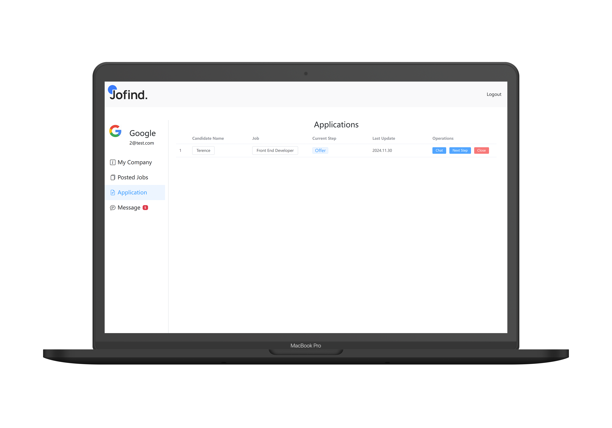

# jofind


## Project Setup

```sh
npm install
```

### Compile and Hot-Reload for Development

```sh
npm run dev
```

### Type-Check, Compile and Minify for Production

```sh
npm run build
```

### Lint with [ESLint](https://eslint.org/)

```sh
npm run lint
```

## Project Features
- [x]  登录
- [x]  注册

### Seeker


- [x]  浏览岗位
   - [x]  投递
   - [ ]  举报


- [ ]  与HR对话
   - [x]  新建对话
   - [x]  查看对话记录
   - [x]  在线对话


- [x]  个人基本信息

- [x]  投递
   - [x]  投递状态查询
   - [x]  投递记录

- [x]  个人简历
   - [x]  初始化设置
   - [x]  修改

    

- [ ]  岗位过滤
    - [x]  个人基本信息
    - [x]  通过薪资范围过滤
    - [x]  通过工作经验要求过滤
    - [ ]  通过地区过滤
    - [ ]  通过职位类型过滤(全职/兼职/等)
       
          
### Company
- [x]  发布岗位
- [x]  公司信息录入
- [x]  查看投递申请
   - [x]  查看求职者简历
   - [x]  投递状态修改
- [x]  Dashboard信息统计
   - [x] 聊天数量
   - [x] 投递数量
   - [x] 发布工作数量
- [x]  与求职者对话
  - [x]  新建对话
  - [x]  查看对话记录
  - [x]  在线对话
         
### Admin
- [ ]  岗位管理
- [ ]  招聘公司管理
- [ ]  求职者管理
- [ ]  tag等数据管理
## Screenhots



